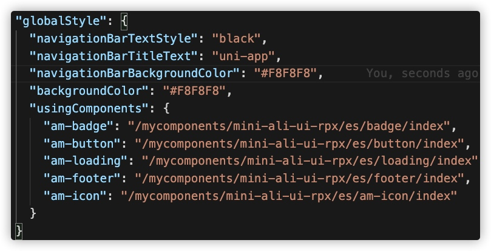

# 在 uniapp 中使用小程序ui组件库（mini-ali-ui-rpx）


uniapp 提供了很多开箱即用的特性，但是业务开发中，弹框之类好像很少使用原生的小程序组件，这个特性其实是支持的。从 uniapp 开发者角度，支持原生小程序特性有利于开发者对现有的小程序做快速迁移，能够兼容社区绝大多数 ui 组件库。

## 兼容操作（以支付宝小程序为例）
1. 在 src 目录中新建 `wxcomponents/mycomponents` 文件夹，用于存放小程序组件
2. 使用：在 pages.json 的 globalStyle -> usingComponents 引入组件，注意这里必须是全局而不是页面级别。
   

3. 在页面中使用
    ```
    <!-- 页面模板 (index.vue) -->
    <view>
        <!-- 在页面中对自定义组件进行引用 -->
        <custom name="uni-app"></custom>
    </view>
    ```

   ## 引入 mini-ali-ui-rpx
    1. 通过 npm 下载 `mini-ali-ui-rpx` 文件
    2. 复制 `mini-ali-ui-rpx` 到 `mycomponents` 文件夹下
    3. 在 pages.json 的 globalStyle -> usingComponents 引入组件，注意如果使用的组件依赖一些基础组件，如`am-icon/am-button`，这些组件必须也要被引入，否则找不到组件，报错。
